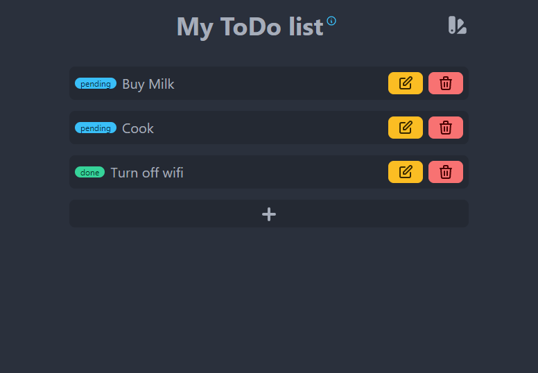

# ToDo app frontend

[GatsbyJS](https://www.gatsbyjs.com/) frontend for a TODO app

## Features

- TypeScript
- 30 themes
- Read, edit, add and delete ToDos

## Development

Run `pnpm dev` to start development. For production bundle, run `pnpm build`. You can check the output with `pnpm serve`.
